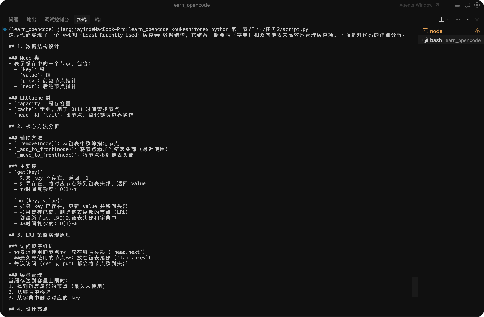
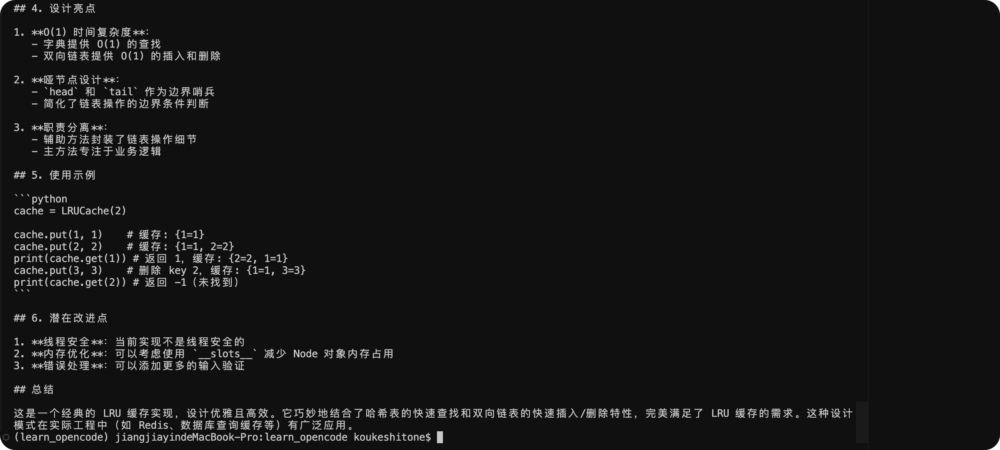
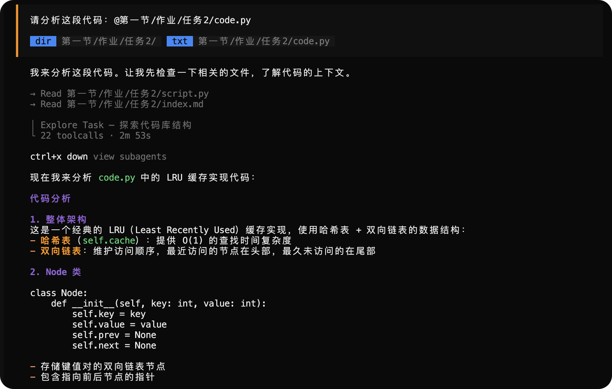
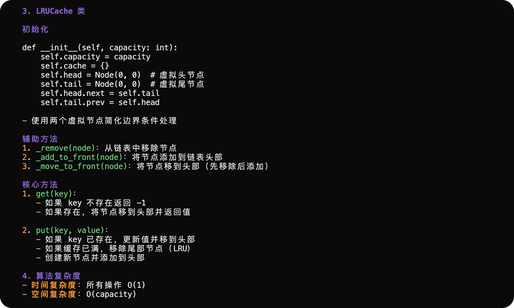

## 裸 API 调用
```bash
# cd 作业/任务2
python script.py
```




## OpenCode 编排




## 对比体会
### 无状态
只是调用了模型API，并没有上下文、工具调用、记忆管理这些组件来规范约束模型的输出，也无法进行推理循环、获取实时信息、搜索外部数据，是一种基于预训练数据的不确定性输出

### 有状态
编排器能够有上下文读写改查的能力，可以进行工具调用，有独特的记忆管理方式，有 Agent Loop，LLM 作为聪明的大脑，编排器（OpenCode）有自己的一套规范LLM输出的设施，确保不确定的LLM输出确定的内容。

