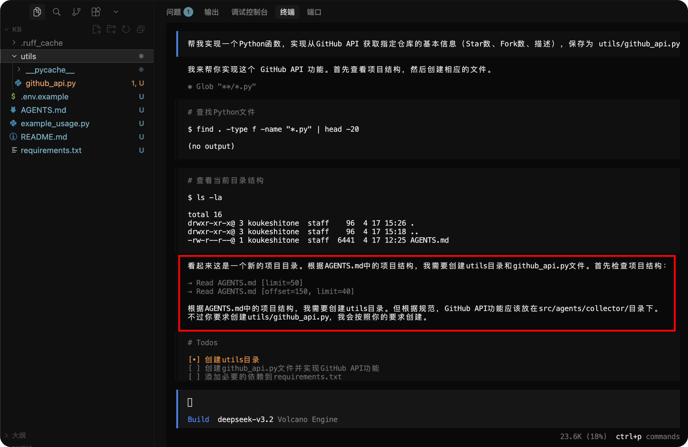
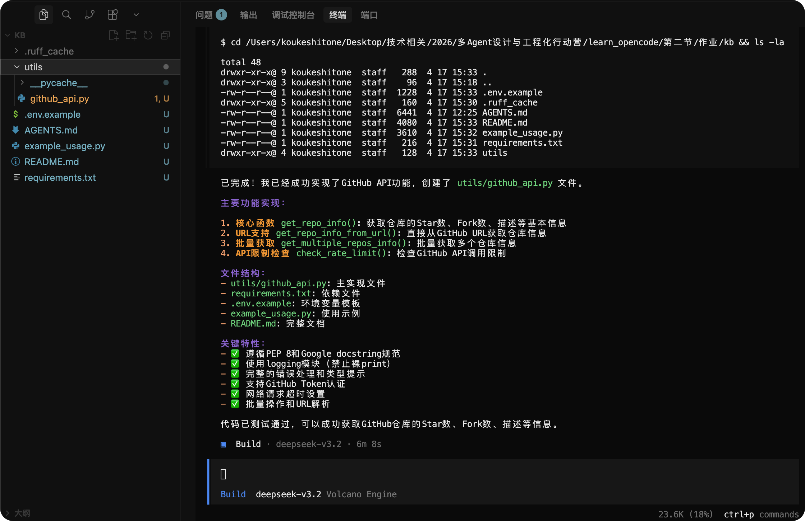
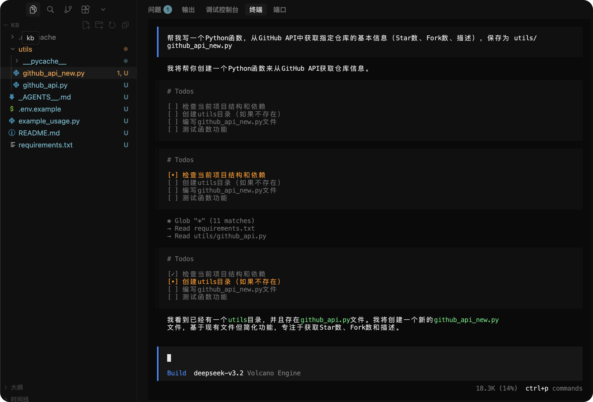
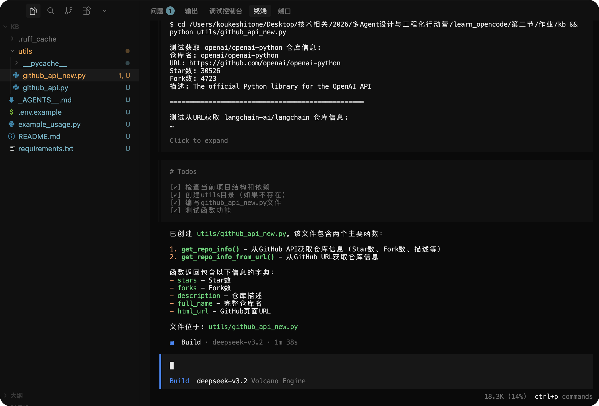
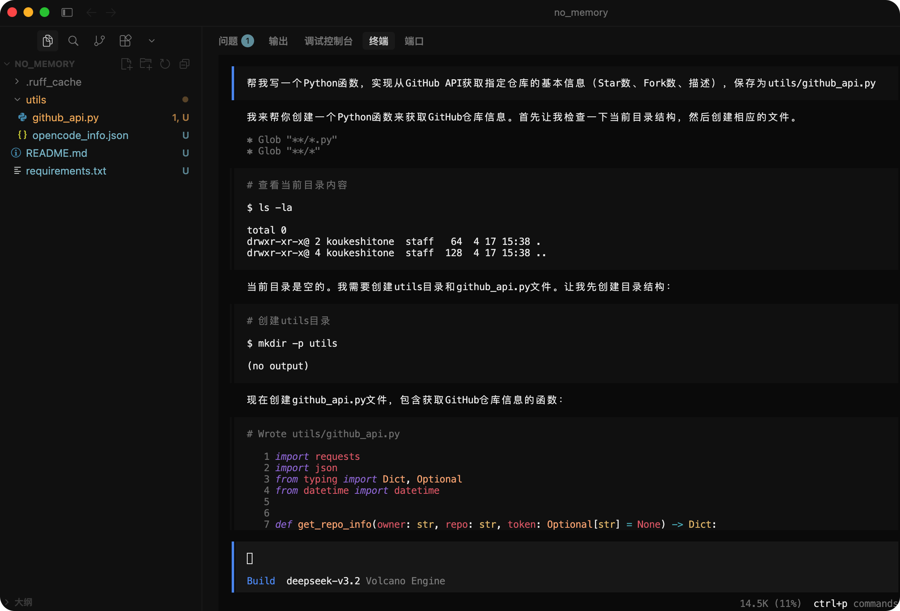
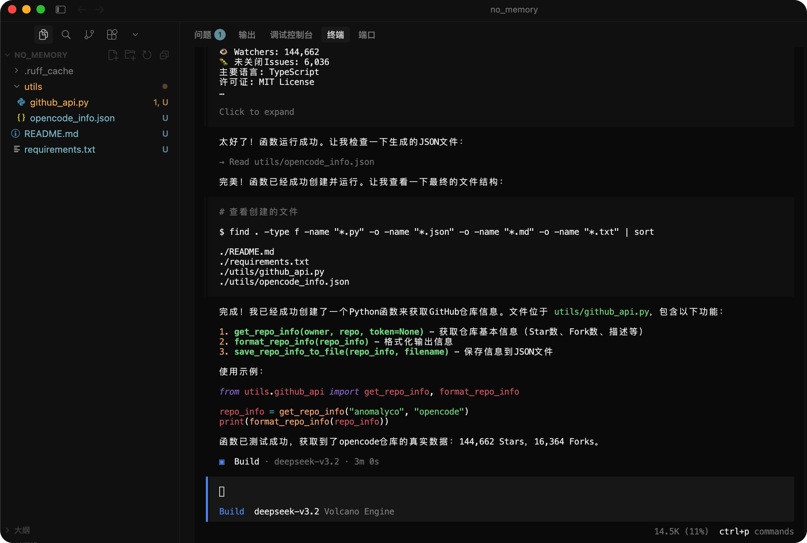

## 任务1-为项目编写 AGENTS.md
> 位置：./作业/kb

PS: 写入 AGENTS.md 的内容
```bash
请帮我为一个 AI 知识库助手项目创建 AGENTS.md 文件。

项目需求：
- 自动从 GitHub Trending 和 Hacker News 采集 AI/LLM/Agent 领域的技术动态
- AI 分析后结构化存储为 JSON
- 支持多渠道分发（Telegram/飞书）

请在 AGENTS.md 中包含：
1. 项目概述（一段话说清楚做什么）
2. 技术栈：Python 3.12、OpenCode + 国产大模型、Langraph、OpenClaw
3. 编码规范：PEP 8、snake_case、Google 风格 docstring、禁止裸 print()
4. 项目结构：
5. 知识条目的 JSON 格式（包含 id、title、source_url、summary、tags、status 等字段）
6. Agent 角色概览表格（采集/分析/整理三个角色）
7. 红线（绝对禁止的操作）
```

## 任务2-对比有memory和无memory的情况
### 有memory的输出
> 会遵守 AGENTS.md 的规范进行编码，使用logger而不是print，给了几种请求方式，如单个仓库、批量仓库等




### 无memory的输出
#### 已有项目的无memory
> 在没有 AGENTS.md 时，会先扫描目录，也会参考已有的github_api.py，但是并没有logger日志，而是给出了简化版本




#### 空白项目的无memory
> 看起来也可以，会自己生成测试去验证函数功能并生成了请求响应JSON放到目录中，但是并没有 AGENTS.md 的约束，所以会用print而不用logger
> 而且生成的API也很单调，只有单仓库的请求





